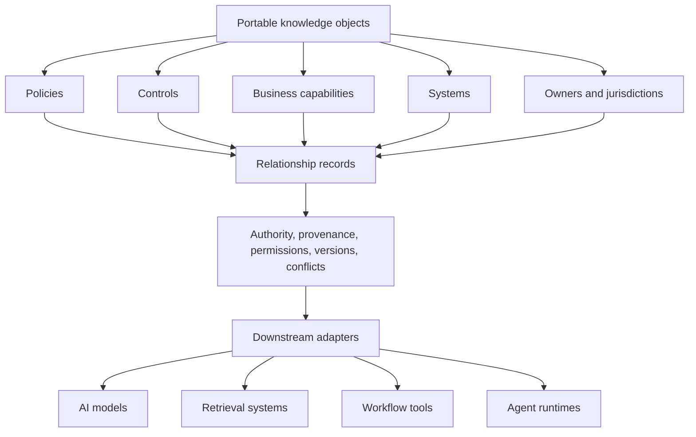

# Enterprise Knowledge Portability

Enterprise knowledge should remain understandable, authoritative, and reusable when models, vendors, applications, and workflows change.

This repository is a public reference implementation for structuring enterprise knowledge outside any single AI model, application database, retrieval index, workflow engine, or vendor-specific agent memory system.

## The Enterprise Problem

Enterprises often encode important operating knowledge in places that are hard to move: policy portals, control libraries, ticket workflows, application tables, knowledge bases, retrieval indexes, prompts, and agent memory stores. When the organization changes models, vendors, applications, or workflows, that knowledge can lose context, authority, provenance, permissions, effective dates, and relationships to the controls or systems that make it operational.

The result is not only migration cost. It is ambiguity about which records are authoritative, which version applies, what a record depends on, who owns it, what evidence supports it, and whether a downstream AI or automation system is allowed to use it.

## What Portability Means Here

Portability means enterprise knowledge is represented in a way that can be inspected, validated, governed, and adapted before it is loaded into a model, index, graph, workflow tool, or agent runtime.

In this repository, portable knowledge has:

- Stable identifiers.
- Explicit object types.
- Human-readable summaries.
- Source authority.
- Provenance.
- Permissions.
- Effective dates.
- Supersession metadata.
- Relationships to other knowledge objects.
- Conflict records instead of silent overwrites.

## What This Repository Demonstrates

The first release demonstrates a small synthetic domain: enterprise policy and control management for a fictional regulated company.

It includes portable records for policies, controls, business capabilities, systems, owners, jurisdictions, effective dates, superseded versions, source authority, permissions, provenance, conflicting records, and relationships between policies and operational controls.

The repository does not implement an ontology, RDF model, OWL model, SHACL validation layer, graph database, vector database, retrieval pipeline, or agent framework. Those may be downstream implementation choices, but they are not the source representation.

## Overview

## Repository Map

| Area | Link | Purpose |
| --- | --- | --- |
| Scope | [docs/scope.md](docs/scope.md) | Defines what this public reference includes and excludes. |
| Why portability matters | [docs/why-portability-matters.md](docs/why-portability-matters.md) | Explains the architecture problem behind portable enterprise knowledge. |
| Design principles | [docs/design-principles.md](docs/design-principles.md) | Explains the modeling principles behind the examples. |
| Portability model | [docs/portability-model.md](docs/portability-model.md) | Describes the layers used to keep knowledge independent of downstream tools. |
| Knowledge object schema | [schemas/knowledge-object.schema.json](schemas/knowledge-object.schema.json) | Defines the shared envelope for portable records. |
| Policy schema | [schemas/policy.schema.json](schemas/policy.schema.json) | Defines portable policy records. |
| Control schema | [schemas/control.schema.json](schemas/control.schema.json) | Defines portable operational control records. |
| Relationship schema | [schemas/relationship.schema.json](schemas/relationship.schema.json) | Defines relationships between portable records. |
| Format mappings | [mappings/canonical-json.md](mappings/canonical-json.md) | Shows how the reference JSON objects can be projected into other formats. |
| Worked example | [examples/policy-and-controls/README.md](examples/policy-and-controls/README.md) | Shows the synthetic policy and control management domain. |
| Authoritative source pattern | [patterns/authoritative-source.md](patterns/authoritative-source.md) | Describes how records identify the authority that asserts them. |
| Provenance pattern | [patterns/provenance.md](patterns/provenance.md) | Describes how records carry origin and review metadata. |
| Versioning pattern | [patterns/versioning-and-supersession.md](patterns/versioning-and-supersession.md) | Describes how records preserve effective dates and supersession history. |
| Permissions pattern | [patterns/permissions.md](patterns/permissions.md) | Describes how records carry usage constraints. |
| Conflict resolution pattern | [patterns/conflict-resolution.md](patterns/conflict-resolution.md) | Describes how conflicting records are preserved and marked. |

## Starting Point

Start with [docs/portability-model.md](docs/portability-model.md), then read the worked example at [examples/policy-and-controls/README.md](examples/policy-and-controls/README.md). After that, inspect [schemas/knowledge-object.schema.json](schemas/knowledge-object.schema.json) to see the common record envelope used across the example.

## Intended Audience

This repository is intended for enterprise architects, AI platform teams, knowledge management teams, governance teams, and engineers who need enterprise knowledge to remain usable across changing AI and application environments.

It is also intended for reviewers who need to understand where authority, permissions, provenance, versioning, and conflict handling are represented before knowledge is used by AI systems or automated workflows.

## Scope And Limitations

This repository provides public reference patterns and synthetic example files. It is not a compliance framework, legal interpretation, policy authoring system, access control implementation, data catalog, model memory service, or production control library.

The examples are intentionally small. They are designed to show structure and boundaries, not to model a complete regulated enterprise or a complete control environment.

## Relationship To Existing Formats And Systems

Formats such as OKF, Markdown, YAML, JSON, knowledge graphs, and vendor-specific agent memory can all be useful in different contexts. This repository treats them as possible representations, targets, or implementation environments rather than as the definition of the knowledge itself.

Markdown is useful for human-readable explanation. YAML and JSON are useful for portable structured records. Knowledge graphs can represent relationships and traversal. Vendor-specific agent memory can support runtime behavior. OKF and similar formats can influence how structured knowledge is exchanged. None of these should be the only place where enterprise meaning, authority, permissions, provenance, and version history exist.

The pattern in this repository is to define durable knowledge records first, then adapt them to the format or runtime needed for a specific implementation.

## Open Knowledge Format example

The worked [Open Knowledge Format mapping](mappings/okf/README.md) projects the existing canonical JSON policy object into an OKF v0.1 Draft bundle. It documents which fields map directly, which fields map partially, and which semantics OKF v0.1 does not represent.

## Vendor-Neutral And Synthetic

This repository is vendor-neutral. It does not depend on any AI provider, model provider, cloud provider, application vendor, vector database, graph database, workflow system, or agent framework.

All examples are synthetic. The fictional company, records, identifiers, systems, authorities, jurisdictions, and URLs are public examples only. URLs use `example.invalid`. The examples are not production systems and do not represent a real organization.

## Enterprise AI Architecture Notes

- [Enterprise AI Architecture Notes](https://notes.example.invalid/enterprise-ai-architecture) provides companion architecture notes for related enterprise AI design topics.

## License

Copyright © 2026 Brad Kaufman. All rights reserved.
