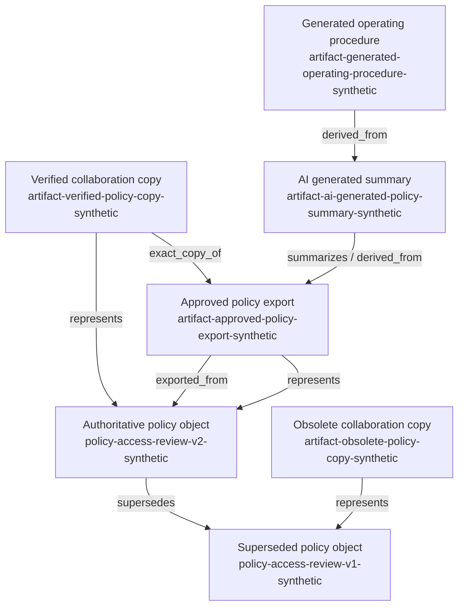

# Document Authority And Derivation Example

This example shows how portable enterprise knowledge can distinguish an authoritative policy record from exports, verified copies, obsolete copies, AI generated summaries, and generated operating procedures.

The scenario reuses the synthetic access review policy and control domain from [../policy-and-controls/README.md](../policy-and-controls/README.md). It answers: which record controls an access review policy decision on July 1, 2026?

## Why This Matters

The latest file is not always authoritative. It may be a generated summary, a draft procedure, or a recently copied obsolete document.

The most retrieved file is not always authoritative. Retrieval rank shows match quality, not governance authority.

The most detailed file is not always authoritative. A generated procedure may contain more steps than the policy, but it cannot govern operational execution until the required authority approves it for that use.

## Files

- [authority-resolution.example.json](authority-resolution.example.json) answers the July 1, 2026 authority question.
- [artifacts/approved-policy-export.json](artifacts/approved-policy-export.json) describes the approved export of the active policy.
- [artifacts/verified-policy-copy.json](artifacts/verified-policy-copy.json) describes a collaboration repository copy verified as an exact copy.
- [artifacts/obsolete-policy-copy.json](artifacts/obsolete-policy-copy.json) describes a copy of the superseded policy version.
- [artifacts/ai-generated-policy-summary.json](artifacts/ai-generated-policy-summary.json) describes a non-authoritative generated summary.
- [artifacts/generated-operating-procedure.json](artifacts/generated-operating-procedure.json) describes a generated procedure awaiting approval.
- [relationships/artifact-lineage.json](relationships/artifact-lineage.json) contains first-class lineage relationships.

## Schema Decision

This example uses [../../schemas/document-artifact.schema.json](../../schemas/document-artifact.schema.json) instead of composing the full common knowledge object envelope. Document artifacts need stable identity, role, lifecycle, authority status, provenance, permissions, verification, storage, lineage, and fingerprints. They do not always need policy/control fields such as assertions, evidence arrays, jurisdictions, or obligations.

The artifact schema reuses the repository's synthetic identifier and URI definitions from [../../schemas/knowledge-object.schema.json](../../schemas/knowledge-object.schema.json). The relationship vocabulary is shared with [../../schemas/relationship.schema.json](../../schemas/relationship.schema.json) so embedded artifact links and first-class relationship records use the same names.

## Lineage

Arrows follow relationship record direction.



## Synthetic Scenario

The active policy object is `policy-access-review-v2-synthetic`. The Synthetic Policy Standards Board is the authority permitted to approve access review policy requirements. The policy is active from 2026-01-01 and supersedes `policy-access-review-v1-synthetic`.

The approved export represents the active policy. It is stored in a synthetic policy management system. It is a controlled representation, but the storage system is not the authority by itself.

The verified collaboration copy has the same SHA-256 fingerprint as the approved export for the `example_content` bytes included in this repository. That verifies byte identity for the hashed example content. It does not transfer authority from the policy authority to the collaboration repository.

The obsolete copy represents the superseded policy version. It can preserve history, but it cannot control an access review policy decision on 2026-07-01.

The AI generated summary is derived from the approved export. It may be useful for orientation, but it is prohibited for policy interpretation, control requirement evaluation, operational execution, and production decisioning.

The generated operating procedure derives from the AI summary and is pending approval. It requires separate approval before it can govern operational steps.

## Fingerprints

The approved export and verified copy both include this SHA-256 value:

```text
0a42f7a4ebb2d70a53e52d2a8ff49e7f3ce6083639ffc5a2d9ecd244305a028d
```

In this public example, the value is computed from the UTF-8 bytes of each file's `example_content` field. Matching hashes can verify byte-level identity for the content that was hashed.

Different hashes do not prove that two documents have different meaning. A format change, metadata change, or rendering change can alter bytes without changing the governed requirement. Semantic similarity can identify possible copies or derivatives, but neither similarity nor retrieval ranking establishes authority.

## Resolution Result

For an access review policy decision on 2026-07-01, [authority-resolution.example.json](authority-resolution.example.json) selects:

- Controlling knowledge object: `policy-access-review-v2-synthetic`.
- Controlling artifact: `artifact-approved-policy-export-synthetic`.
- Asserting authority: `authority-policy-standards-board-synthetic`.
- Scope: identity and access, policy interpretation, control requirement evaluation, `jurisdiction-example-north-synthetic`, `capability-customer-record-management-synthetic`, effective on 2026-07-01.

The AI generated summary is excluded because it is a non-authoritative derivative and its permissions prohibit policy interpretation and control requirement evaluation.

The obsolete copy is excluded because it represents `policy-access-review-v1-synthetic`, which was superseded on 2026-01-01.

The generated operating procedure is excluded because it has not received the approval required to govern operational execution.

The verified collaboration copy is not selected as the controlling artifact because it is a replica. The matching hash verifies the copy relationship; it does not make the collaboration repository authoritative.

## Related Patterns

- [Document authority and derivation](../../patterns/document-authority-and-derivation.md)
- [Authority resolution](../../patterns/authority-resolution.md)
- [Authoritative source](../../patterns/authoritative-source.md)
- [Versioning and supersession](../../patterns/versioning-and-supersession.md)
- [Permissions](../../patterns/permissions.md)
- [Conflict resolution](../../patterns/conflict-resolution.md)

## Limits

This example is synthetic and vendor neutral. It does not model a real company, regulator, policy system, approval workflow, production document repository, or operating control. It does not claim that the model determines factual truth. An organization must define the authority and governance rules; portable records preserve and expose those rules for downstream systems.
